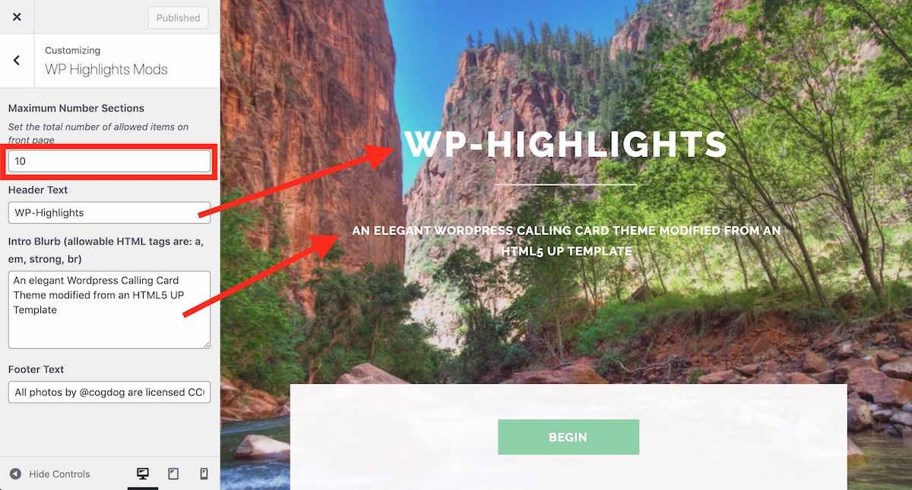
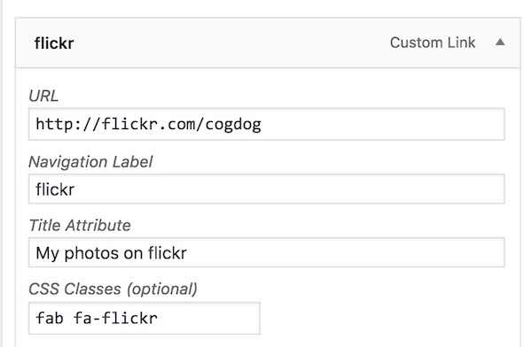
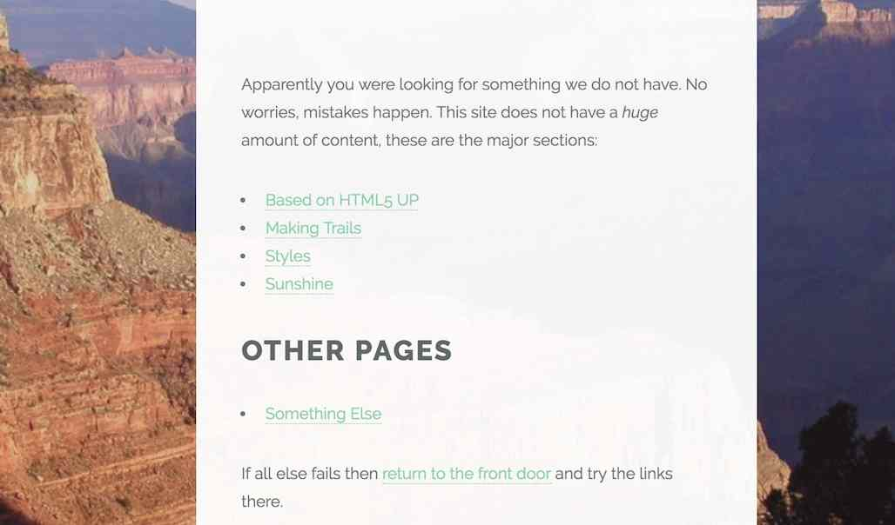

# HTML5 Up Highlights Theme for Wordpress

-----
*If this kind of stuff has any value to you, please consider supporting me so I can do more!*

 

----- 

A configurable Wordpress Theme version of [HTML5up Highlights Theme](https://html5up.net/highlights) made for the internet by [@cogdog](http://cog.dog). It creates a simple, elegant calling card something that looks like

You can see a demo version at http://lab.cogdogblog.com/highlights/

For simple content, this can be a one page site, but use of the Wordpress `more` tag allows for longer content on a single page template, while what is above the tag appears on the home page of the site. 

The top/splash screen is configured in the Wordpress Customizer. The backdrop image is managed by the **Header Background** controls in the Customizer, which means you have an option of loading several images that can be set to appear at random on page load.

Subsequent sections as you scroll down (or use the automatic generated menu) are managed as separate posts. If the post has a featured image, on a wide screen the background image will change to it. As the page is scrolled farther, these images continue to change.

Posts without featured images use the default theme header image in the background.

Each front section provides bottom arrow navigation to the next section as well as an `edit this` link for logged in users so they can directly edit the content.

The bottom footer can be customized with a social media icon menu and a custom footer menu text.

Highlights works best for smaller amounts of content in each section, it's meant for high level summaries, and you can use hypertext links to expand to other sites. But still, some people want a lot of content in this site, so a features was added to mark the opening bits of a post to appear on the front, with a link to see expanded content in a single page ([see below for more](#splitting-content-into-see-more)).

## Examples

* Center for Transitional Learning (Lansing Community College) https://ctl.openlcc.net/
* Cup of Teaching (Kim Carter) https://cupofteaching.ca/
* Jane Van Galen http://janevangalen.com/
* Theme demo version http://lab.cogdogblog.com/highlights/
* Recommended APA Resources (Laura Killam) http://apa.nursekillam.com/

## Installing From Reclaim Hosting

If you are wise enough to host your web sites at [Reclaim Hosting](http://reclaimhosting.com/) you have the option of installing a fully functioning site with this theme ([a copy of the demo site](http://lab.cogdogblog.com/highlights/)) including recommended plugins, configured settings and sample content, all done  in one click. *But wait there is more!* With this method of installing your site, future updates to the theme are automatically added to your site.

In your cpanel, under **Applications** go to **All Applications**. This theme is available listed under Fratured Applications; just install from there.

*Note that unlike other WordPress installs, this one will not preserve your username/password, so be sure to save that information.* When it's done, log into your new site and start making it your own. 

## Installing from Scratch

Install this theme on any self hosted Wordpress site. No luck on Wordpress.com, get a real web hosting package. 

You should download a ZIP file of this GitHub Repo (that's via the green **Clone or Download*" button above as a file `wp-highlights-master.zip`). 

The zip can be uploaded directly to your site via **Add Themes** in the Wordpress dashboard. Of you run into size upload limits or just prefer going old school like me, unzip the package and ftp the entire folder into your `wp-content/themes` directory.

Follow the directions below for customizing, some additional plugins may need to be installed.

## Updating the Theme

If you have ftp/sftp access to your site (or this can be done in a cpanel file manager), simply upload the new theme files to the `wp-content/themes` directory that includes the older version theme. 

For those that lack direct file upload access or maybe that idea sends shivers down the spine, upload and activate the [Easy Theme and Plugin Upgrades](https://wordpress.org/plugins/easy-theme-and-plugin-upgrades/) plugin -- this will allow you to upload a newer version of a theme as a ZIP archive, the same way you add a theme by uploading.

## Customizing with the Customizer

The main elements are set and previewed in `Appearance` -> `Customize`

### Site Name. Anything you want!

Under `Site Identity` edit the title that shows up in the footer as well as an optional description of the site as a tagline.

### Use Header Image to Set Top Background

Under `Header Image` upload an image (recommended size 1024 x 768 px or bigger) to place a background image for the intro section and the footer of the site

Once you have changed it, you will see it immediately previewed on the right.

With the **Header image** controller you can upload more than one image, and use the option to randomize each time the page loads.

### Highlights Mod Content

Other parts of the top of the home page and and the footer are also configured in the Customizer. Change the title and the blurb content (which can include HTML):

The text for **Footer Text** is  used for additional information in the footer:

### Social Media Icons

This theme supports the use of a plugin for adding to the footer a  menu of social media links.

> **NOTE** Previous versions of the themes used the [Font Awesome 4 Menus](https://wordpress.org/plugins/font-awesome-4-menus/) plugin, which is not compatible with the latest set of [Font Awesome icons](https://fontawesome.com/icons) I have built an update to this plugin in you want access to a larger set of icons. You will also need to add `fab` to the menu class names (see below)

To have a customized set of icon links on the front of the site, download, install and activate the [Font Awesome 5 Menus](https://github.com/cogdog/font-awesome-5-menus) plugin. This allows you to add an icon to any menu item.

From the Wordpress Dashboard look under **Appearances** for **Menus**. Click **create a new menu**  name it whatever you like -- `social` is  a good choice. Under  **Menu Settings** next to **Display Location** check the box for `Social Media`. 

To add a social media (or any link), open the panel for **Custom Link**. 

Enter a title for the site and provide the URL that points to your content on that site. Add as many as you like. You can drag and drop them to change the order.

To set the icon, you must first enable the visibility of CSS classes for each menu item.  Click **Screen Options** in the upper right, and check the box for **CSS Classes**.

Open an item in your Social Menu and you will now see a field for entering CSS Class names. You have the choice to add from [well over 1400 icons in the Font Awesome free collection](https://fontawesome.com/icons?d=gallery&m=free). Find the name of the icon you wish to use, and enter it's all of it's class names as listed,

For example these are the class names to render the icon for typical social media sites (these should be all lower case):

* fab fa-twitter
* fab fa-facebook
* fab fa-youtube
* fab fa-linkedin
* fab fa-instagram
* fab fa-flickr

With the Font Awesome icons, you can add any site you wish to be in your footer and pick the icon you prefer.

**Save** your menu and check out the spiffy icons in the footer.

In addition, if you want to provide a tool tip hover for the icons, look again under  **Screen Options** and enable the option for **Title Attribute**. This adds another editable field to add the tooltip text.

## Editing Content

The content for the blocks are managed as Wordpress Posts.  For each block you want create a post. If you want the animated style with a large background image, add a Featured image that is at least 1028 x 768 px in size- big beautiful images. 

The order of the sections is controlled via the post sidebar **Post Attributes** option for... **Order**, lower numbers are displayed higher in the site.

The site now accommodates up to 10 sections.

The Dashboard Posts view will list your sections in the order specified. To change the order quickly, hover a title and use the **Quick Edit** link to change the value of the order attribute.

## Splitting Content into Read More

Okay, you want to write more content than displays well on the front of the site? This theme includes a template for a single post view to read a longer piece of content. You can use the Wordpress **Read More** feature to mark where in your post to split what appears on the front of the site.

In the Wordpress editor, find the place in your post where you want this split to occur, and use the **Read More** button to place the marker.

When an `Read More` has been added to a post, on the front of your site, only the portion above the line is visible, and a **more...** link is added.

Following the link leads to a single post view that will open to the part of the post below the `Read More` marker, the featured image in the background

If you were to enter the single post by it's URL, you would see the site header, it's background image, the post title, and the content above the **More** button.

## Pages Too!

You can also create stand alone content that is not part of the scrolling front if you use Pages. The format is similar to single posts, the top of the page uses the site header/background and page title, and a button that jumps down to the page content. See

http://lab.cogdogblog.com/highlights/else/

## Got Styles?

Yep. The styles of the HTML5up theme are available; [see the demo site for examples](http://lab.cogdogblog.com/highlights/styles/). It might require some HTML editing to setup and/or maybe use of CSS classes.

## Uh Oh, Room 404

There won't be a great deal of content on a typical site, and to cover a case of a bad link, this, and all other of the themes like this now have a not found page. This generates a list of all posts, followed by any pages, as well as a link to the front.

Try it now!

http://lab.cogdogblog.com/highlights/whereami

## Suggested Plugins

* [Font Awesome 4 Menus](https://wordpress.org/plugins/font-awesome-4-menus/) used to add the  icons to the social media links in the footer
* [Fluid Video Embeds](https://wordpress.org/plugins/fluid-video-embeds/) will make sure your auto embedded videos (and other content wordpress can embed by URL) are responsive sized to fill the column width
* [Easy Theme and Plugin Upgrades](https://wordpress.org/plugins/easy-theme-and-plugin-upgrades/) allows you yo update the theme by uploading the zip file again as a new server (because wordpress does not provide this capability)
* [JetPack](https://wordpress.org/plugins/jetpack/) can add a number of capabilities, such as adding a contact form or a variety of other image galleries (try Mosaic). If you do [create a contact form](https://jetpack.com/support/contact-form/), make sure you also add and activate [Akismet](http://akismet.com/) because *you will get spam*
* [Regenerate Thumbnails](https://wordpress.org/plugins/regenerate-thumbnails/) If you change to this theme from another one, you should run this plug to re-generate previously uploaded images in the specific sizes used by the theme.

## Credits

* **Default backdrop image** "What a View" flickr photo by cogdogblog https://flickr.com/photos/cogdog/344384584 into the public domain using [Creative Commons Public Domain Dedication (CC0](https://creativecommons.org/publicdomain/zero/1.0/)

* [HTML5 Up Highlights theme](https://html5up.net/highlights) is shared under a [Creative Commons (BY) license](https://html5up.net/license)
